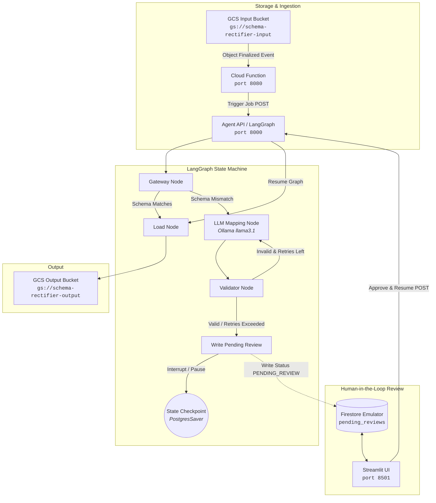

# Agentic Schema Rectifier

An LLM-powered, human-in-the-loop data ingestion pipeline that automatically rectifies and maps malformed or non-standard tabular column names against a target standard schema and data dictionary.

The system is built on **LangGraph**, **FastAPI**, **Streamlit**, and **Google Cloud Platform (GCP)** primitives (Cloud Storage, Firestore, Cloud Functions), fully emulated locally with **Docker Compose** and **Ollama**.

The architecture I chose for this task of renaming incoming csv file header columns if they don’t match a known target schema has one LLM feature, the rest are deterministic LangGraph nodes. The LLM feature takes in a single invalid column name and rectifies it with respect to a data dictionary. Originally, I wanted to feed all of the invalid columns into the LLM, but it didn’t perform as well as running multiple LLM calls to work on only one invalid column at a time.

---

## Architecture Overview



### Technical Component Breakdown (`docker-compose.yml`)

| Service | Container / Image | Port(s) | Description |
| :--- | :--- | :--- | :--- |
| **`cloud-function`** | `cloud_function/Dockerfile` (Functions Framework) | `8080` | Simulates a GCS-triggered Cloud Function listening for CloudEvents (`google.cloud.storage.object.v1.finalized`) and dispatching ingestion jobs to `agent-api`. |
| **`agent-api`** | `agent_api/Dockerfile` (FastAPI + LangGraph) | `8000` | Exposes REST endpoints to trigger (`/rectify-schema/trigger`), monitor (`/{thread_id}/status`), and resume (`/{thread_id}/resume`) schema rectification workflows. |
| **`streamlit-ui`** | `streamlit_ui/Dockerfile` (Streamlit) | `8501` | Human-in-the-loop review interface for reviewing, editing, and approving proposed column mappings. |
| **`db`** | `postgres:15-alpine` | `5432` | Postgres database for LangGraph state persistence and checkpointing via `PostgresSaver`. |
| **`gcs-emulator`** | `fsouza/fake-gcs-server:latest` | `4443` | Local Google Cloud Storage emulator backed by the `./fake-gcs-data` volume. Stores configuration, input files, and rectified output files. |
| **`firestore-emulator`** | `mtlynch/firestore-emulator-docker` | `8081` (host) / `8080` (container) | Local Firestore emulator storing job review records under the `pending_reviews` collection. |
| **`llm-runtime`** | `ollama/ollama` | `11434` | Local LLM runtime container that serves `llama3.1` for schema inference and column mapping. |

---

## LangGraph State Machine Workflow

1. **`gateway`**: Reads the uploaded CSV header from GCS and compares it against the standard destination schema (`standard_schema.json`). If the schema matches, it transitions directly to `load`. If mismatches exist, it flags the missing/differing columns and routes to `single_column_name_mapping`.
2. **`single_column_name_mapping`**: Prompts the LLM (`llama3.1` via Ollama) with the loaded data dictionary (`data_dictionary.json`), standard schema definition, and current column diffs to infer correct source-to-destination column mappings.
3. **`single_column_name_mapping_validator`**: Validates that all mapped destination columns exist within the standard schema. If invalid mappings are detected, it decrements the retry budget and loops back to the LLM node; otherwise, it moves to `write_pending_review`.
4. **`write_pending_review`**: Writes the candidate column mappings and thread metadata to Firestore with status `PENDING_REVIEW`. The graph is configured with `interrupt_before=["load"]`, pausing execution until human approval.
5. **`load`**: Triggered after human review approval. Reads the original CSV from GCS, applies the approved column renames using **Polars**, and writes the rectified CSV (`<filename>_rectified.csv`) to the output GCS bucket.

---

## Getting Started

### Prerequisites

- **Docker** and **Docker Compose**
- **Python >= 3.14** and [**`uv`**](https://github.com/astral-sh/uv) (for local development and testing)

### Setup

Install local dependencies and synchronize the virtual environment:

```bash
bash setup.sh
```

*(Alternatively: `uv sync`)*

---

## Demo Workflow

The demo workflow simulates the full ingestion lifecycle: uploading a CSV with non-standard column names to GCS, triggering the Cloud Function via a CloudEvent, generating LLM mappings, reviewing the mappings in Streamlit, and loading the rectified dataset.

### Step 1: Launch the Docker Stack

Start all services in Docker Compose:

```bash
bash run.sh
```

> **Note**: On initial startup, the `llm-runtime` container will download the `llama3.1` model. Wait until all containers (especially `agent-api` and `llm-runtime`) have initialized and are healthy.

### Step 2: Trigger the Emulated Ingestion

In a separate terminal, trigger the Cloud Function:

```bash
bash trigger.sh
```

**How it works**:
- `trigger.sh` emulates Google Cloud Storage bucket notifications by sending a JSON CloudEvent (`ce-type: google.cloud.storage.object.v1.finalized`) to the Cloud Function at `http://localhost:8080`.
- The event simulates the upload of `example.csv` to `gs://schema-rectifier-input/example.csv`.
- The Cloud Function receives the event and sends an execution request to `agent-api` (`http://localhost:8000/rectify-schema/trigger`).
- `agent-api` starts the LangGraph workflow, queries Ollama (`llama3.1`) to resolve column mismatches, and pauses at the `load` node breakpoint.

### Step 3: Human Review in Streamlit

1. Open your browser and navigate to **`http://localhost:8501`**.
2. You will see the job with status **`PENDING_REVIEW`**.
3. Inspect the LLM's proposed column mappings in the interactive data table. You can edit any mappings directly in the UI if needed.
4. Click **"Approve & Trigger Downstream"**.
5. The UI calls `POST http://localhost:8000/{thread_id}/resume` to update the LangGraph state and resume execution.

### Step 4: Verify Output

Once resumed, the `load` node writes the rectified CSV to `gs://schema-rectifier-output/example_rectified.csv`. You can inspect the logs or check `./fake-gcs-data/schema-rectifier-output/` to view the processed file.

---

## Running Tests

Unit and integration tests are executed using Python's `unittest` runner inside the `uv` environment:

```bash
bash test.sh
```

*(Alternatively: `PYTHONPATH=src uv run python -m unittest discover -s tests`)*

### Test Suite Summary

- `test_gateway_node.py`: Validates schema matching and column diff detection against standard schema definitions.
- `test_mapping_node.py`: Tests prompt construction and LLM response handling for single and multi-column mapping scenarios.
- `test_validator_node.py`: Verifies column mapping validation and retry logic.
- `test_human_review_node.py`: Tests Firestore persistence and human review status transitions.
- `test_graph_execution.py`: End-to-end integration tests for LangGraph execution, including happy-path execution, retry loops on validation failure, and state resumption after human approval/rejection.

---

## Configuration

Standard schema rules and data dictionary references are located in `fake-gcs-data/schema-rectifier-config/`:

- **`standard_schema.json`**: Defines the authoritative target column names expected by downstream applications.
- **`data_dictionary.json`**: Contains field descriptions, synonym mappings, and data type specifications used by the LLM during mapping inference.